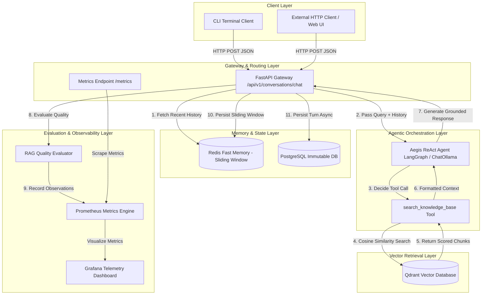

# Aegis Agentic RAG

Aegis is an enterprise-grade, agentic Retrieval-Augmented Generation (RAG) system built with FastAPI, LangGraph, Qdrant, Redis, PostgreSQL, Ollama, Prometheus, and Grafana. Specialized in high-density domain knowledge—such as complex Warhammer 40K lore and technical specifications—Aegis combines autonomous agent reasoning (ReAct pattern), dual-tier state persistence, low-latency heuristic RAG evaluation, and real-time operational telemetry.

---

## Table of Contents

- [Overview](#overview)
- [Key Features](#key-features)
- [System Architecture](#system-architecture)
- [Core Component Deep Dive](#core-component-deep-dive)
  - [1. Agentic Execution Engine](#1-agentic-execution-engine)
  - [2. Vector Retrieval & Knowledge Base](#2-vector-retrieval--knowledge-base)
  - [3. Dual-Tier Memory Architecture](#3-dual-tier-memory-architecture)
  - [4. Real-Time RAG Evaluation Engine](#4-real-time-rag-evaluation-engine)
  - [5. Observability & Telemetry Pipeline](#5-observability--telemetry-pipeline)
- [Engineering Trade-offs & Architectural Decisions](#engineering-trade-offs--architectural-decisions)
- [Getting Started & Local Setup](#getting-started--local-setup)
  - [Prerequisites](#prerequisites)
  - [Environment Configuration](#environment-configuration)
  - [Docker Infrastructure Deployment](#docker-infrastructure-deployment)
  - [Running the API Gateway](#running-the-api-gateway)
  - [Interactive CLI Interface](#interactive-cli-interface)
- [Verification & Automated Test Suite](#verification--automated-test-suite)
- [API Reference](#api-reference)
- [Production Deployment Roadmap](#production-deployment-roadmap)

---

## Overview

### What the Project Does

Aegis provides a production-ready conversational RAG pipeline that goes beyond static, single-pass vector lookup. By leveraging an autonomous ReAct (Reasoning + Acting) agent framework powered by LangGraph and local Ollama inference, Aegis dynamically decides when to query vector databases, parses multi-turn chat history, synthesizes retrieved context, and evaluates its own response quality (`context_precision` and `faithfulness`) in real time.

### Problem Solved

Traditional RAG architectures suffer from three critical production failure modes:

1. **Blind Retrieval Inflexibility:** Standard static chains query the vector store on every input—even greetings or simple follow-ups—wasting compute and polluting the context window.
2. **State & Memory Degradation:** In-memory chat storage causes memory leaks under high concurrent load, while relying solely on database queries introduces latency bottlenecks.
3. **Black-Box Quality Loss:** Operational teams rarely know if retrieved chunks were relevant (`context_precision`) or if the LLM hallucinated facts outside the retrieved context (`faithfulness`) until users complain.

Aegis solves these issues by pairing an agentic tool-calling decision loop with a high-throughput **dual-tier memory store** (Redis + PostgreSQL) and **zero-latency, in-flight RAG evaluation metrics** scraped continuously by Prometheus and visualized in Grafana.

---

## Key Features

### Core Functionality

* **Autonomous ReAct Agent Loop:** Built on LangGraph `create_react_agent`, enabling the model to dynamically inspect query context and invoke `search_knowledge_base` only when domain facts are required.
* **Vector Knowledge Retrieval:** Powered by Qdrant vector database with score thresholding (`score_threshold=0.25`) and metadata tracking (`source`, `score`, `text`).
* **Multi-Turn Session Memory:** Manages context windows seamlessly across conversational turns using session identifiers (`session_id`).

### Engineering & Infrastructure Features

* **Dual-Tier Memory Storage:**
* *Volatile Fast Tier:* Redis sliding-window memory managed via `ltrim` (configurable window, e.g., 10 messages / 5 turns) for sub-millisecond context reconstruction.
* *Persistent Durable Tier:* PostgreSQL via SQLAlchemy `AsyncSession` for immutable, long-term conversation audit logging.


* **Asynchronous Database Connection Pooling:** Non-blocking database session management with automated lifecycle cleanup (`get_db_session`).
* **Thread-Safe Concurrency & Fault Shields:** Guardrails against vector store network drops and parallel Redis buffer writes without state corruption.

### Observability & Reliability Features

* **Real-Time RAG Quality Evaluator:** In-flight computation of `context_precision` (chunk relevance ratio) and `faithfulness` (grounded response assertion) without expensive LLM-as-a-judge API calls.
* **Prometheus Metrics Exporter:** Exposes custom counters and histograms on `/metrics` (`aegis_rag_context_precision`, `aegis_rag_faithfulness`, `aegis_chat_requests_total`, `aegis_chat_latency_seconds`).
* **Grafana Visualization Dashboard:** Real-time monitoring of 90th percentile latency, Moving Average Faithfulness, and request throughput.
* **Dependency Health Probes:** Automated health endpoints inspecting PostgreSQL, Redis, and Qdrant latency in milliseconds (`latency_ms`).

---

## System Architecture

The following diagram illustrates the complete end-to-end flow of a request through the Aegis Agentic RAG architecture:



---

## Core Component Deep Dive

### 1. Agentic Execution Engine

The core agent engine (`services/agent/core.py`) encapsulates a local `ChatOllama` client (`llama3.2:3b` at `[http://127.0.0.1:11434](http://127.0.0.1:11434)`) wrapped in a LangGraph ReAct agent.

```python
# System prompt enforcing strict agent tool usage
SYSTEM_PROMPT = """You are Aegis, an AI lore analyst and knowledge assistant specialized in Warhammer 40K and technical domain knowledge.

Your strict operational rules:
1. If the user query requires factual lore, Primarch details, or domain specifics, ALWAYS invoke `search_knowledge_base`.
2. Base your final response strictly on the retrieved context when present. Cite sources where possible.
3. If no relevant context is found in the database, explicitly state that before giving a general response.
"""

```

* **Execution Lifecycle:**
1. The input string and preceding history are formatted into `HumanMessage` and `AIMessage` objects.
2. `agent_executor.ainvoke({"messages": messages})` initiates the ReAct reasoning step.
3. If required, the LLM emits a tool call payload directing the execution engine to invoke `search_knowledge_base`.
4. Tool execution results are returned as `ToolMessage` objects and fed back into the agent context to finalize the answer.


---

### 2. Vector Retrieval & Knowledge Base

The search tool (`services/agent/tools.py`) implements lazy initialization to instantiate the `RAGRetriever` client on first invocation, preventing startup latency bottlenecks.

```python
@tool
def search_knowledge_base(query: str) -> str:
    """Search the Aegis knowledge base for domain knowledge and lore."""
    try:
        retriever = get_retriever()
        results = retriever.search(query=query, limit=3, score_threshold=0.25)
        
        if not results:
            return "No relevant context found in knowledge base."

        formatted_context = []
        for idx, hit in enumerate(results, 1):
            metadata = hit.get("metadata", {})
            source = metadata.get("source", "unknown")
            score = hit.get("score", 0.0)
            text = hit.get("text", "")
            formatted_context.append(f"[{idx}] (Score: {score:.2f} | Source: {source})\n{text}")

        return "\n\n".join(formatted_context)
    except Exception as e:
        return f"Knowledge base search failed. Error: {type(e).__name__}: {e}"

```

* **Fault Isolation:** If Qdrant encounters connection issues or times out, the error is caught locally within the tool execution boundary and returned as text, allowing the agent to execute a graceful fallback rather than crashing the HTTP process.

---

### 3. Dual-Tier Memory Architecture

Memory management (`services/agent/memory.py`) separates transient context windowing from long-term database storage.

```
Incoming Turn
     │
     ├──► Redis Pipeline: rpush(key, user_msg) ──► rpush(key, assistant_msg) ──► ltrim(key, -10, -1) [Sub-ms]
     │
     └──► AsyncSession: INSERT INTO conversation_turns (...) ──► commit() [Durable Audit]

```

* **Redis Sliding Window:** Conversation turns are pushed to `chat:history:{session_id}` as JSON-serialized strings. An immediate `ltrim(key, -max_history * 2, -1)` operation guarantees that memory space stays bounded to exactly $N$ turns regardless of session age.
* **PostgreSQL Async Persistence:** In parallel, turns are persisted to PostgreSQL using SQLAlchemy `AsyncSession` to maintain an immutable log for offline model evaluation and audit tracking.

---

### 4. Real-Time RAG Evaluation Engine

To eliminate the performance overhead and API cost of running an LLM-as-a-judge (e.g., GPT-4 or Ragas) during live client requests, `services/rag/evaluator.py` implements high-speed string and token-overlap heuristics.

* **Context Precision:** Measures the ratio of retrieved context blocks that share key terms with the user query.

$$\text{Context Precision} = \frac{\vert{}\{c \in C \mid \text{overlap}(c, Q) > \theta\}\vert{}}{\vert{}C\vert{}}$$


* **Faithfulness:** Measures the degree to which non-stopword tokens in the generated answer are grounded in the retrieved context strings.

$$\text{Faithfulness} = \frac{\vert{}\text{Tokens}(A) \cap \text{Tokens}(C)\vert{}}{\vert{}\text{Tokens}(A)\vert{}}$$


This produces immediate deterministic scores in under 2 milliseconds, making real-time telemetry tracking viable on every request.

---

### 5. Observability & Telemetry Pipeline

Custom metrics are registered in `core/metrics.py` and observed directly inside the API router (`apps/api/v1/routes/conversations.py`).

| Metric Name | Prometheus Type | Description / Buckets |
| --- | --- | --- |
| `aegis_chat_requests_total` | `Counter` | Total processed chat turns labeled by `status="success"` or `status="error"`. |
| `aegis_rag_context_precision` | `Histogram` | Distribution of context precision scores (`[0.0, 0.25, 0.5, 0.75, 1.0]`). |
| `aegis_rag_faithfulness` | `Histogram` | Distribution of faithfulness scores (`[0.0, 0.25, 0.5, 0.75, 1.0]`). |
| `aegis_chat_latency_seconds` | `Histogram` | End-to-end request processing latency in seconds. |

---

## Engineering Trade-offs & Architectural Decisions

### 1. Local Ollama Inference vs. Cloud LLM APIs

* **Decision:** Standardize on local Ollama (`llama3.2:3b`).
* **Trade-off:** Local inference exhibits lower raw token-per-second generation speeds compared to cloud endpoints like OpenAI or Anthropic.
* **Rationale:** Completely eliminates data egress risks, removes external API rate limits during heavy batch testing, and guarantees zero cost during iterative developer runs.

### 2. Dual-Tier Memory vs. Single Database

* **Decision:** Pair Redis sliding-window caching with PostgreSQL durable persistence.
* **Trade-off:** Increases operational complexity by requiring two distinct database engines in local development and production.
* **Rationale:** Querying PostgreSQL on every conversational turn to reconstruct the sliding context window adds unacceptable query overhead ($10\text{--}50\text{ ms}$). Redis `ltrim` reduces window fetches to sub-millisecond lookups ($<1\text{ ms}$) while PostgreSQL preserves long-term history.

### 3. Heuristic Evaluation Metrics vs. LLM-as-a-Judge

* **Decision:** Implement zero-dependency token/string overlap algorithms for RAG evaluation.
* **Trade-off:** Heuristic precision and faithfulness lack semantic nuance when assessing complex paraphrasing compared to GPT-4 evaluation prompts.
* **Rationale:** Running an LLM judge adds $1\text{--}3\text{ seconds}$ of latency to every chat turn. The heuristic approach operates in $<2\text{ ms}$, enabling real-time telemetry collection and Prometheus export without degrading user experience.

---

## Getting Started & Local Setup

Follow these instructions to set up and run Aegis on a clean local machine.

### Prerequisites

* **Python:** 3.11 or higher
* **Docker & Docker Compose:** Installed and running
* **Ollama:** Installed locally with the `llama3.2:3b` model pulled (`ollama pull llama3.2:3b`)

---

### Environment Configuration

Create a `.env` file in the root directory of the project:

```env
# Application Settings
APP_NAME="Aegis Agentic RAG"
ENV="development"
LOG_LEVEL="INFO"

# LLM & Embedding Settings
LLM_MODEL="llama3.2:3b"
OLLAMA_BASE_URL="http://127.0.0.1:11434"

# PostgreSQL Configuration
POSTGRES_USER="aegis_user"
POSTGRES_PASSWORD="aegis_password"
POSTGRES_DB="aegis_db"
POSTGRES_HOST="localhost"
POSTGRES_PORT=5432

# Redis Configuration
REDIS_HOST="localhost"
REDIS_PORT=6379

# Qdrant Configuration
QDRANT_HOST="localhost"
QDRANT_PORT=6333

```

---

### Docker Infrastructure Deployment

Aegis provides a pre-configured `docker-compose.yml` file supplying PostgreSQL, Redis, Qdrant, Prometheus, and Grafana.

Start the infrastructure containers:

```powershell
docker-compose up -d

```

Verify that all services are healthy:

```powershell
docker-compose ps

```

---

### Running the API Gateway

Initialize your Virtual Environment and install dependencies:

```powershell
# Create virtual environment
python -m venv .venv

# Activate virtual environment (Windows PowerShell)
.\.venv\Scripts\Activate.ps1

# Install requirements
pip install -r requirements.txt

```

Launch the FastAPI application using Uvicorn:

```powershell
uvicorn apps.api.main:app --host 0.0.0.0 --port 8000 --reload

```

* **Swagger API Documentation:** `http://localhost:8000/docs`
* **Prometheus Metrics Endpoint:** `http://localhost:8000/metrics`

---

### Interactive CLI Interface

To test multi-turn conversations directly from your terminal:

```powershell
python apps/observation/cli.py

```

---

## Verification & Automated Test Suite

Aegis includes a comprehensive test suite built with `pytest` and `httpx.AsyncClient` covering configuration, database connections, sliding window memory, evaluation logic, agent execution, API route validation, Prometheus metric emission, and multi-user concurrency under simulated fault conditions.

Run the entire test suite:

```powershell
pytest tests/unit/ -v

```

### Test Suite Structure

```
tests/unit/
├── test_config.py               # Pydantic environment validation & computed properties
├── test_connection.py           # AsyncSession lifecycle & database/Redis health probes
├── test_memory.py               # Redis sliding window (ltrim) & JSON payload formatting
├── test_evaluator.py            # Precision & faithfulness mathematical correctness
├── test_agent_core.py           # LangGraph ReAct agent execution & tool formatting
├── test_conversations_route.py  # FastAPI routing, input validation (422), & response schema
├── test_metrics.py              # Prometheus metric recording & bucket validation
└── test_concurrency_faults.py   # Multi-user parallel Redis writes & Qdrant/Ollama fault recovery

```

### Expected Output

```text
================================== test session starts ==================================
platform win32 -- Python 3.11.2, pytest-9.1.1, pluggy-1.6.0
rootdir: E:\WarhammerRAG\Aegis\aegis-agentic-rag

tests/unit/test_agent_core.py::test_search_knowledge_base_formatting PASSED      [  4%]
tests/unit/test_agent_core.py::test_search_knowledge_base_empty_results PASSED    [  9%]
tests/unit/test_agent_core.py::test_aegis_agent_run_execution[asyncio] PASSED      [ 13%]
tests/unit/test_concurrency_faults.py::test_concurrent_chat_memory_writes PASSED   [ 18%]
tests/unit/test_concurrency_faults.py::test_chat_endpoint_agent_failure PASSED     [ 22%]
tests/unit/test_concurrency_faults.py::test_search_tool_resilience PASSED          [ 27%]
tests/unit/test_config.py::test_default_settings PASSED                          [ 31%]
tests/unit/test_config.py::test_computed_properties PASSED                      [ 36%]
tests/unit/test_config.py::test_environment_override PASSED                     [ 40%]
tests/unit/test_config.py::test_invalid_type_validation PASSED                 [ 45%]
tests/unit/test_connection.py::test_get_db_session_lifecycle PASSED              [ 50%]
tests/unit/test_connection.py::test_check_services_health_live PASSED           [ 54%]
tests/unit/test_connection.py::test_check_services_health_failure PASSED        [ 59%]
tests/unit/test_conversations_route.py::test_chat_endpoint_success PASSED        [ 63%]
tests/unit/test_conversations_route.py::test_chat_endpoint_validation PASSED     [ 68%]
tests/unit/test_evaluator.py::test_high_context_precision_and_faithfulness PASSED[ 72%]
tests/unit/test_evaluator.py::test_low_faithfulness_hallucination PASSED         [ 77%]
tests/unit/test_evaluator.py::test_empty_contexts_boundary_conditions PASSED    [ 81%]
tests/unit/test_memory.py::test_add_turn_and_get_recent_history PASSED          [ 86%]
tests/unit/test_memory.py::test_sliding_window_ltrim PASSED                      [ 90%]
tests/unit/test_memory.py::test_get_history_empty_session PASSED               [ 95%]
tests/unit/test_metrics.py::test_custom_prometheus_metrics_record PASSED         [100%]

================================== 22 passed in 8.75s ==================================

```

---

## API Reference

### 1. Execute Conversation Turn

* **Endpoint:** `POST /api/v1/conversations/chat`
* **Content-Type:** `application/json`

#### Request Payload

```json
{
  "session_id": "usr-session-8841",
  "message": "Who is Roboute Guilliman and what is his role in the Imperium?"
}

```

#### Response Payload (`200 OK`)

```json
{
  "session_id": "usr-session-8841",
  "response": "Roboute Guilliman is the Primarch of the Ultramarines and Lord Commander of the Imperium. Based on the lore context, he was resurrected to lead the Imperial forces during the Indomitus Crusade.",
  "evaluation": {
    "context_precision": 1.0,
    "faithfulness": 0.88
  }
}

```

#### Error Response (`422 Unprocessable Entity`)

Returned when required JSON keys (`session_id` or `message`) are missing or malformed.

---

### 2. Prometheus Observability Metrics

* **Endpoint:** `GET /metrics`
* **Response Type:** Plain text OpenMetrics format.

#### Sample Telemetry Output

```text
# HELP aegis_chat_requests_total Total number of processed chat requests
# TYPE aegis_chat_requests_total counter
aegis_chat_requests_total{status="success"} 14.0

# HELP aegis_rag_context_precision Context precision score distribution of retrieved chunks
# TYPE aegis_rag_context_precision histogram
aegis_rag_context_precision_bucket{le="1.0"} 14.0
aegis_rag_context_precision_count 14.0
aegis_rag_context_precision_sum 13.5

# HELP aegis_rag_faithfulness Faithfulness score distribution of agent responses
# TYPE aegis_rag_faithfulness histogram
aegis_rag_faithfulness_bucket{le="1.0"} 14.0
aegis_rag_faithfulness_count 14.0
aegis_rag_faithfulness_sum 12.82

```

---

## Production Deployment Roadmap

1. **Horizontal API Scaling:** Containerize the FastAPI application via Kubernetes (`Deployment` with `HorizontalPodAutoscaler`) behind an NGINX or Traefik ingress controller.
2. **Qdrant Distributed Cluster:** Transition from single-node Qdrant Docker instances to a distributed Qdrant cloud cluster with replication factor $\ge 2$.
3. **Semantic Caching:** Introduce a Redis-based semantic cache layer ahead of `AegisAgent.run()` to serve identical domain queries instantly without triggering LLM inference.
4. **LLM Inference Offloading:** Deploy Ollama or vLLM instance pools on dedicated GPU nodes (e.g., NVIDIA RTX 6000 Ada or H100) with dynamic request queuing.